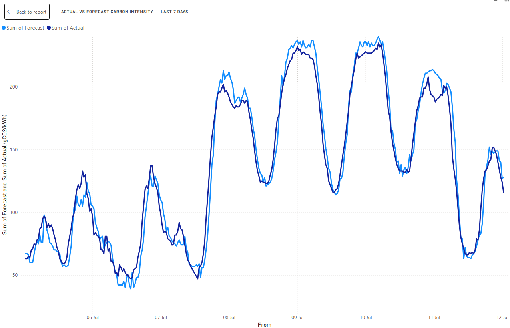
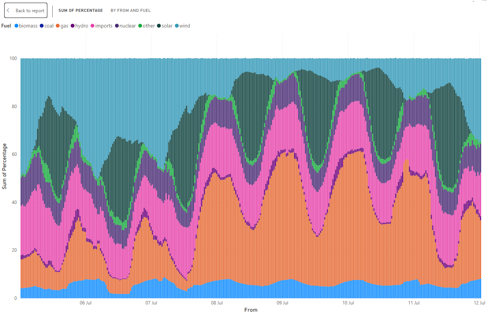

  # Energy Data Insights

Weekly analysis of UK energy market data — live datasets, Power BI dashboards, and insights, built as an ongoing public series.

## About
This project tracks real UK energy market data over time, turning it into 
clear visuals and analysis. I am Ahsan Bin Ahmed, an Energy Markets Specialist in the UK. Aiming to build these as a 
public portfolio of applied data work.

## Dashboard Preview

## Week 1: Carbon Intensity (National Grid ESO)

**Source:** [Carbon Intensity API](https://carbonintensity.org.uk/) — live, 
public, no authentication required.

**What's in this analysis:**
- Actual vs Forecast carbon intensity (gCO2/kWh) over 7 days
- Generation mix by fuel type (gas, wind, solar, nuclear, etc.) over the 
  same period

**Files:**
- `ABA_CarbonIntensity.pbix` — Power BI file
- `screenshots/` — chart images (for quick viewing without opening Power BI)

**Key observation:**
Over the week analysed, National Grid ESO's forecast 
carried a systematic time-of-day bias rather than random error: it 
consistently overestimated carbon intensity overnight (11pm–7am, by 
8-16 gCO2/kWh) and underestimated it during the afternoon peak 
(3pm-5pm, by 11-19 gCO2/kWh). Mean absolute error across the week was 
10.3 gCO2/kWh. Correlation with generation mix was modest, with imports 
and nuclear share showing the strongest (though still weak) 
relationship — worth tracking over further weeks before drawing a firm 
conclusion.

## Week 2: Carbon Intensity — Pattern Check (National Grid ESO)

**Source:** [Carbon Intensity API](https://carbonintensity.org.uk/) — live, 
public, no authentication required.

**Charts:**

**What's in this analysis:**
- Actual vs Forecast carbon intensity (gCO2/kWh) over a fresh 7-day window
- Generation mix by fuel type over the same period
- A direct comparison against Week 1's findings, to check whether the 
  forecast bias was a one-off or a repeating pattern

**Files:**
- `ABA_CarbonIntensity.pbix` — Power BI file (updated for Week 2 dates)
- `screenshots/` — Week 2 chart images

**Key observation:** The time-of-day forecast bias identified in Week 1 
repeated in a fresh, independent week of data. Forecasts again ran too 
high overnight and too low during the afternoon peak — overnight average 
gap -6.8 gCO2/kWh, afternoon average +11.5 gCO2/kWh. Mean absolute error 
improved slightly (8.6 vs 10.3 gCO2/kWh in Week 1), but the directional 
pattern held. Two weeks in, this looks structural rather than random.

## Findings Log
- **Week 1 (27 Jun–4 Jul):** Forecast carried a systematic time-of-day 
  bias — too high overnight (11pm-7am, by 8-16 gCO2/kWh), too low during 
  the afternoon peak (3-5pm, by 11-19 gCO2/kWh). Mean absolute error: 
  10.3 gCO2/kWh.
- **Week 2 (5-12 Jul):** Same directional bias repeated — overnight too 
  high (avg -6.8), afternoon too low (avg +11.5). Mean absolute error 
  improved slightly to 8.6 gCO2/kWh. Two weeks in, the pattern looks 
  structural rather than random.

## Roadmap
Future weeks will cover: NESO forecast accuracy, Elexon settlement data, 
DESNZ energy trends, and Ofgem data portal — each
