  # Energy Data Insights

Weekly analysis of UK energy market data — live datasets, Power BI dashboards, and insights, built as an ongoing public series.

## About
This project tracks real UK energy market data over time, turning it into 
clear visuals and analysis. I am Ahsan Bin Ahmed, an Energy Markets Specialist in the UK. Aiming to build these as a 
public portfolio of applied data work.

## Dashboard Preview

## Week 1: Carbon Intensity (National Grid ESO)

**Source:** [Carbon Intensity API](https://carbonintensity.org.uk/) — live, 
public, no authentication required.

**What's in this analysis:**
- Actual vs Forecast carbon intensity (gCO2/kWh) over 7 days
- Generation mix by fuel type (gas, wind, solar, nuclear, etc.) over the 
  same period

**Files:**
- `ABA_CarbonIntensity.pbix` — Power BI file
- `screenshots/` — chart images (for quick viewing without opening Power BI)

**Key observation:**
Over the week analysed, National Grid ESO's forecast 
carried a systematic time-of-day bias rather than random error: it 
consistently overestimated carbon intensity overnight (11pm–7am, by 
8-16 gCO2/kWh) and underestimated it during the afternoon peak 
(3pm-5pm, by 11-19 gCO2/kWh). Mean absolute error across the week was 
10.3 gCO2/kWh. Correlation with generation mix was modest, with imports 
and nuclear share showing the strongest (though still weak) 
relationship — worth tracking over further weeks before drawing a firm 
conclusion.

## Week 2: Carbon Intensity — Pattern Check (National Grid ESO)

**Source:** [Carbon Intensity API](https://carbonintensity.org.uk/) — live, 
public, no authentication required.

**Charts:**
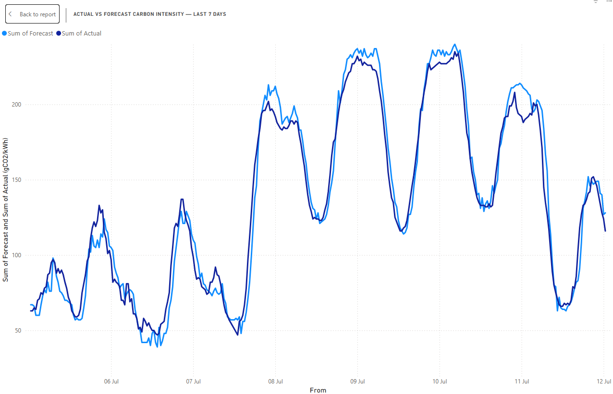
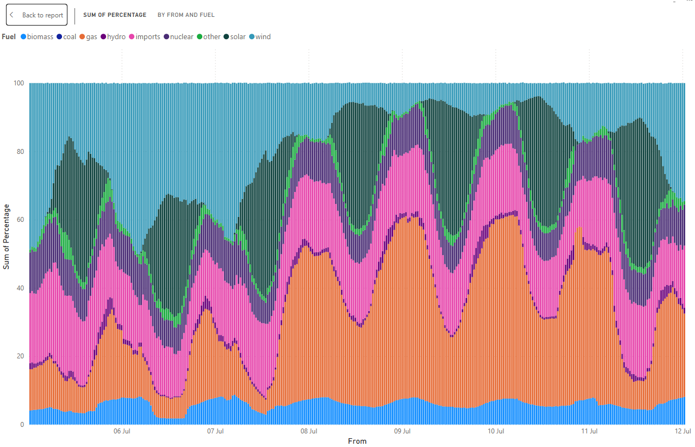

**What's in this analysis:**
- Actual vs Forecast carbon intensity (gCO2/kWh) over a fresh 7-day window
- Generation mix by fuel type over the same period
- A direct comparison against Week 1's findings, to check whether the 
  forecast bias was a one-off or a repeating pattern

**Files:**
- `ABA_CarbonIntensity.pbix` — Power BI file (updated for Week 2 dates)
- `screenshots/` — Week 2 chart images

**Key observation:** The time-of-day forecast bias identified in Week 1 
repeated in a fresh, independent week of data. Forecasts again ran too 
high overnight and too low during the afternoon peak — overnight average 
gap -6.8 gCO2/kWh, afternoon average +11.5 gCO2/kWh. Mean absolute error 
improved slightly (8.6 vs 10.3 gCO2/kWh in Week 1), but the directional 
pattern held. Two weeks in, this looks structural rather than random.

## Bonus: Match Night Demand (Elexon)

**Source:** [Elexon Insights Solution](https://bmrs.elexon.co.uk/) — 
Initial National Demand Outturn (INDO), live, public, no authentication 
required.

**What's in this analysis:**
- GB national demand (MW) across the evening of the England vs Norway 
  World Cup quarter-final, 11 July 2026

**Chart:**
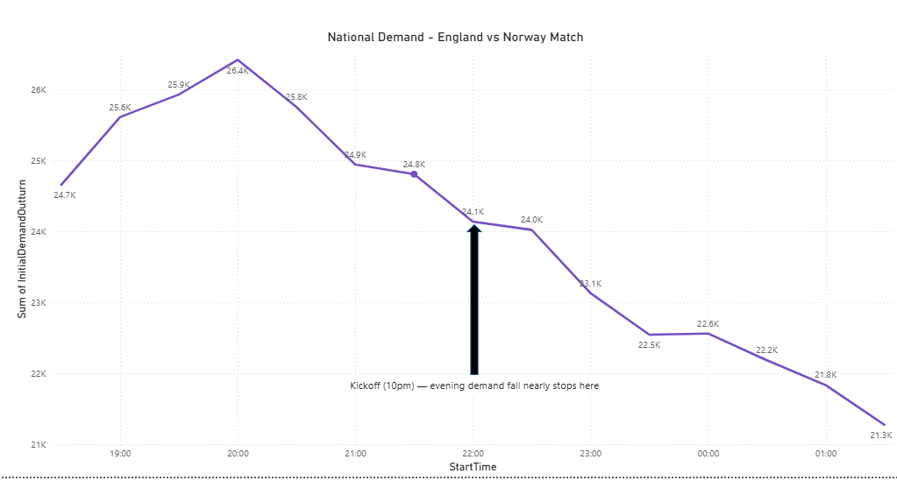

**Key observation:** Demand fell steadily through the evening as usual 
(600-900MW every half hour), but right at kickoff (10pm), the fall 
nearly stopped — just 116MW, the smallest drop of the night. A second 
check is planned around tonight's England vs Argentina semi-final to 
see if the pattern repeats.

## Week 3: Carbon Intensity — Pattern Evolving (National Grid ESO)

**Source:** [Carbon Intensity API](https://carbonintensity.org.uk/) — live, 
public, no authentication required.

**Charts:**
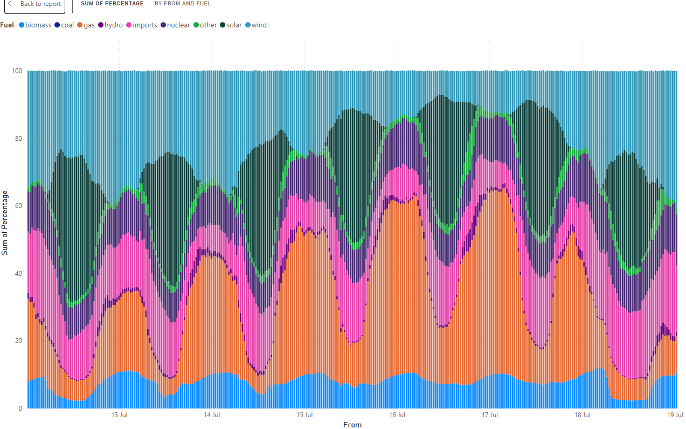
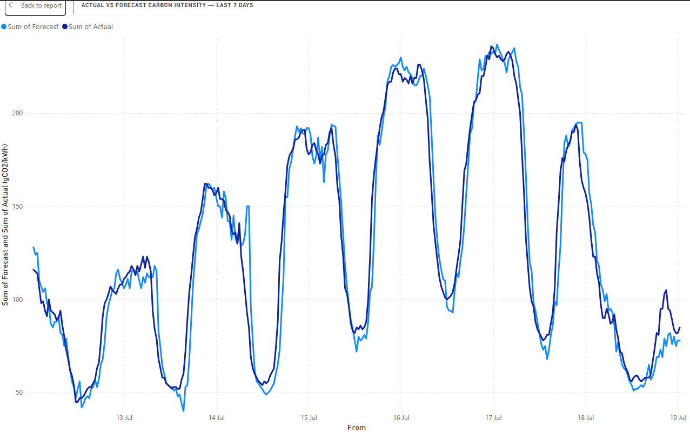

**What's in this analysis:**
- Actual vs Forecast carbon intensity (gCO2/kWh) over a third independent 
  7-day window
- Generation mix by fuel type over the same period
- A three-week comparison to check whether the forecast bias is stable 
  or shifting

**Files:**
- `ABA_CarbonIntensity.pbix` — Power BI file (updated for Week 3 dates)
- `screenshots/week3/` — Week 3 chart images

**Key observation:** The directional bias held for a third straight week 
(forecast too high overnight, too low in the afternoon), but its shape 
is shifting — the overnight gap has been shrinking each week (8-16 → 6.8 
avg → 3.4 avg gCO2/kWh), while the afternoon gap has been growing (11-19 
→ 11.5 avg → 17.1 avg gCO2/kWh). Mean absolute error stayed roughly 
stable at 9.4 gCO2/kWh. A notable new gap also appeared around 8-9am 
(-22.8 gCO2/kWh) — worth watching next week to see if it recurs.

## Roadmap
Future weeks will cover: NESO forecast accuracy, Elexon settlement data, 
DESNZ energy trends, and Ofgem data portal — each

## Week 4: Carbon Intensity — Four-Week Trend (National Grid ESO)

**Source:** [Carbon Intensity API](https://carbonintensity.org.uk/) — live, 
public, no authentication required.

**What's in this analysis:**
- Actual vs Forecast carbon intensity (gCO2/kWh) over a fourth 
  independent 7-day window
- Generation mix by fuel type over the same period
- A four-week trend comparison — enough data now to see a real trajectory, 
  not just repetition

- **Charts:**
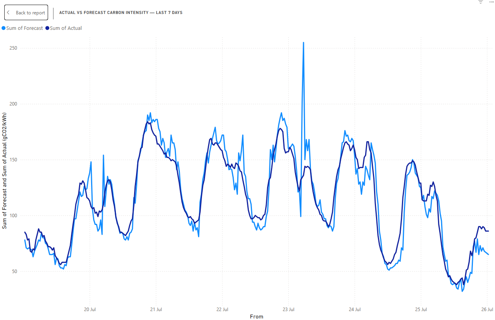
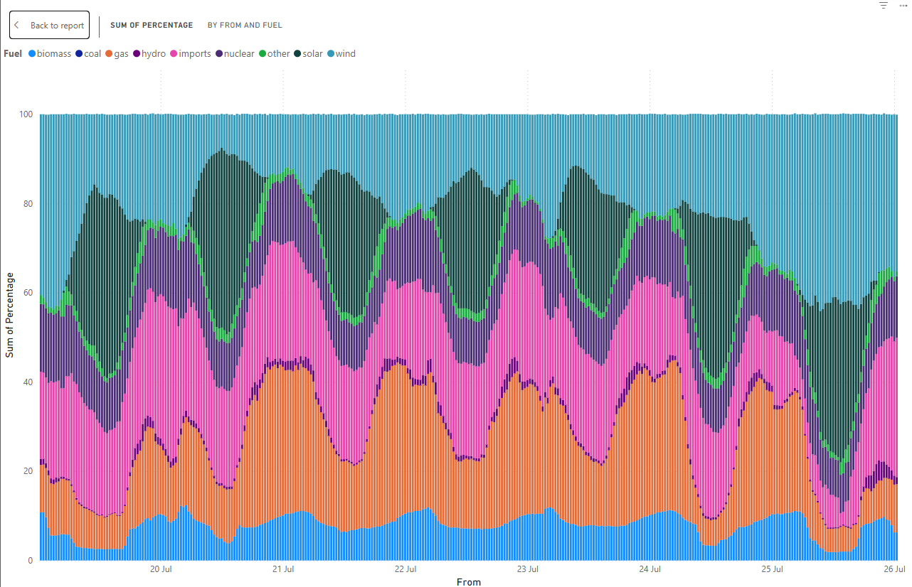

**Files:**
- `ABA_CarbonIntensity.pbix` — Power BI file (updated for Week 4 dates)
- `screenshots/week4/` — Week 4 chart images

## Week 5: Carbon Intensity — Trend Reversal (National Grid ESO)

**Source:** [Carbon Intensity API](https://carbonintensity.org.uk/) — live, 
public, no authentication required.

**What's in this analysis:**
- Actual vs Forecast carbon intensity (gCO2/kWh) over a fifth 
  independent 7-day window
- Generation mix by fuel type over the same period

**Files:**
- `ABA_CarbonIntensity.pbix` — Power BI file (updated for Week 5 dates)
- `screenshots/week5/` — Week 5 chart images

- **Charts:**
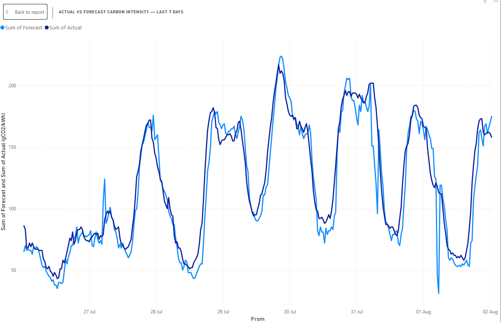
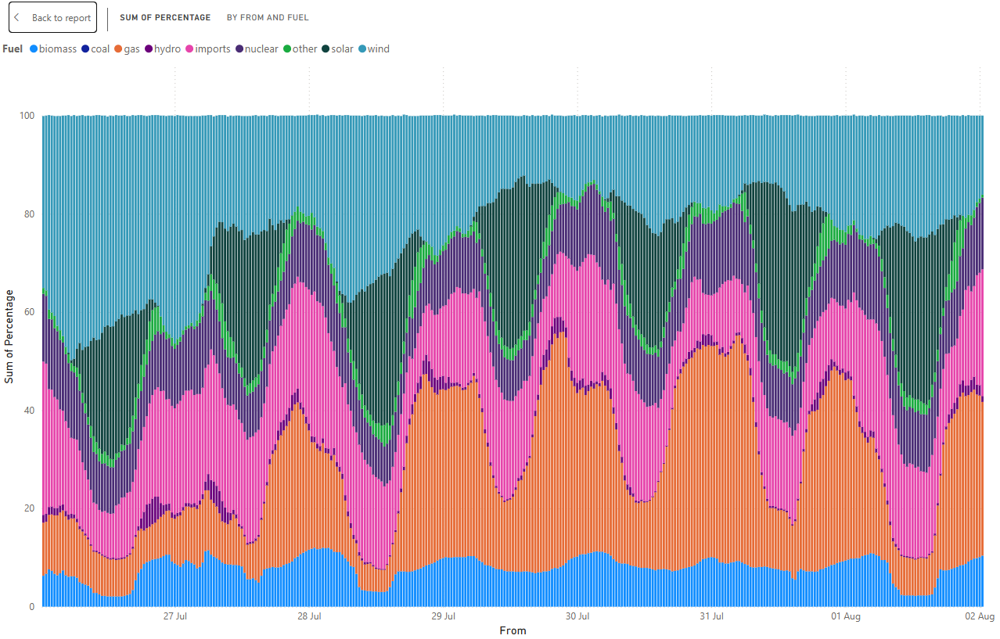

**Key observation:** After four straight weeks of the overnight bias 
shrinking toward zero, it crossed over this week — forecasts now run 
slightly too low overnight (+1.3 avg) rather than too high. Afternoon 
bias jumped to its highest point yet (+18.8), and mean absolute error 
rose to its weakest week so far (10.9). The four-week trend didn't hold 
as a straight line.

## Week 6: Carbon Intensity — Accuracy Declining (National Grid ESO)

**Source:** [Carbon Intensity API](https://carbonintensity.org.uk/) — live, 
public, no authentication required.

**What's in this analysis:**
- Actual vs Forecast carbon intensity (gCO2/kWh) over a sixth 
  independent 7-day window
- Generation mix by fuel type over the same period

**Files:**
- `ABA_CarbonIntensity.pbix` — Power BI file (updated for Week 6 dates)
- `screenshots/week6/` — Week 6 chart images

**Key observation:** MAE rose to 12.0 gCO2/kWh, the weakest week yet at 
that point. The overnight bias that flipped positive in Week 5 stayed 
positive (+2.3), confirming that shift wasn't a one-off. A sharp, brief 
drop in actual carbon intensity to near-zero was observed on 6 August 
around midday — flagged but not yet explained.

- **Charts:**
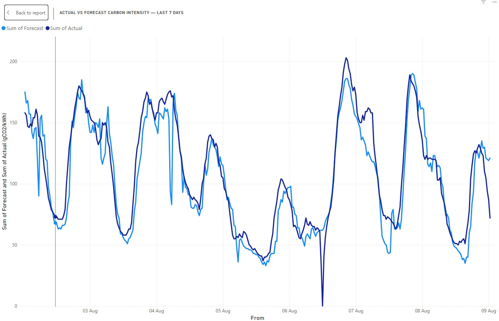
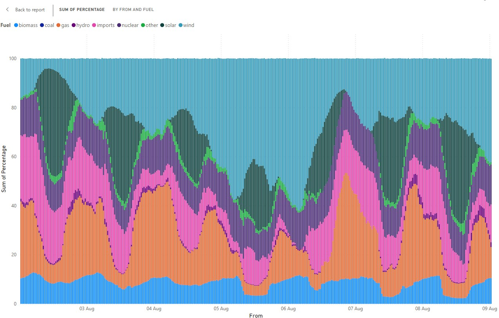

## Week 7: Carbon Intensity — Third Straight Week of Declining Accuracy

**Source:** [Carbon Intensity API](https://carbonintensity.org.uk/) — live, 
public, no authentication required.

**What's in this analysis:**
- Actual vs Forecast carbon intensity (gCO2/kWh) over a seventh 
  independent 7-day window
- Generation mix by fuel type over the same period

**Files:**
- `ABA_CarbonIntensity.pbix` — Power BI file (updated for Week 7 dates)
- `screenshots/week7/` — Week 7 chart images

- **Charts:**
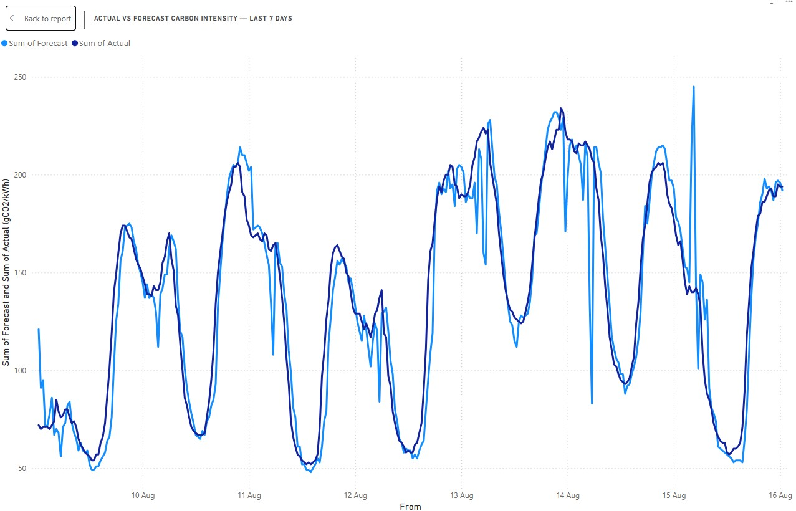
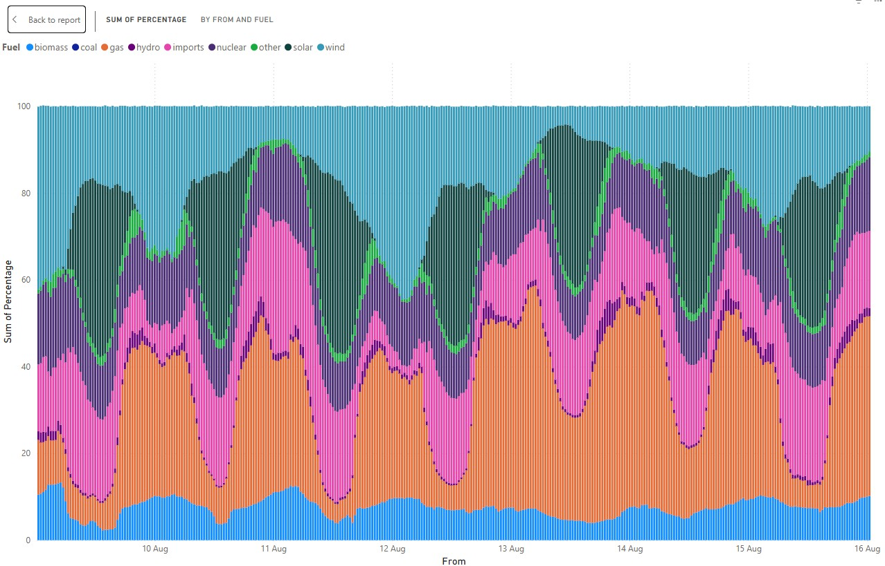

**Key observation:** MAE rose again to 12.2 gCO2/kWh — a third 
consecutive week of declining accuracy. Overnight bias has settled 
close to zero, but the afternoon bias hit its highest point of the 
whole tracker (+20.5), and the single largest error across all seven 
weeks occurred this week (125 gCO2/kWh at 5:30am, 14 August).

## Findings Log
- **Week 1 (27 Jun–4 Jul):** Forecast carried a systematic time-of-day 
  bias — too high overnight (11pm-7am, by 8-16 gCO2/kWh), too low during 
  the afternoon peak (3-5pm, by 11-19 gCO2/kWh). Mean absolute error: 
  10.3 gCO2/kWh.
- **Week 2 (5-12 Jul):** Same directional bias repeated — overnight too 
  high (avg -6.8), afternoon too low (avg +11.5). Mean absolute error 
  improved slightly to 8.6 gCO2/kWh. Two weeks in, the pattern looks 
  structural rather than random.
- **Week 3 (12-19 Jul):** Directional bias held for a third week, but 
  shape is shifting — overnight gap shrinking (was -16, now -3.4 avg), 
  afternoon gap growing (was +19, now +17.1 avg). MAE roughly stable at 
  9.4 gCO2/kWh.
- **Week 4 (19-26 Jul):** Overnight bias shrunk for a fourth consecutive 
  week (-2.3 avg) — clear trend. Afternoon bias reversed course, pulling 
  back to +8.5 after two weeks of growth. Week 3's 8-9am anomaly did not 
  repeat at scale. MAE stable at 9.7, consistent with prior weeks.
- **Week 5 (26 Jul-2 Aug):** Overnight bias crossed zero (+1.3),
- **Week 6 (2-9 Aug):** MAE rose to 12.0, weakest week yet at that point. 
  Overnight bias stayed positive (+2.3), confirming Week 5's reversal 
  wasn't a one-off. Unexplained near-zero intensity dip observed 6 Aug.
- **Week 7 (9-16 Aug):** MAE rose again to 12.2 — third straight week of 
  declining accuracy. Overnight bias settled near zero; afternoon bias 
  hit its highest point yet (+20.5). Largest single error of the 
  tracker so far (125 gCO2/kWh).
  reversing the 4-week shrinking trend. Afternoon bias hit its highest 
  point (+18.8). MAE rose to 10.9, the weakest week yet.
